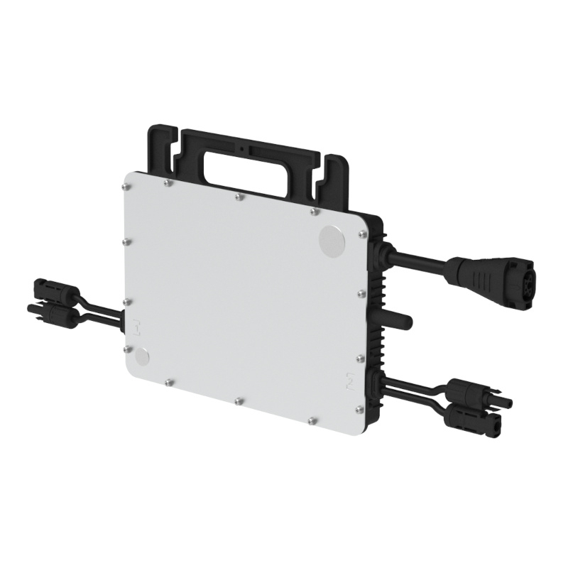

# ioBroker.hoymiles-wifi

## hoymiles-wifi adapter for ioBroker

Communication with Hoymiles DTUs and the HMS-XXXXW-2T HMS microinverters, utilizing protobuf messages. Disclaimer: This library is not affiliated with Hoymiles. It is an independent project developed to provide tools for interacting with Hoymiles HMS-XXXXW-2T series micro-inverters featuring integrated WiFi DTU. Any trademarks or product names mentioned are the property of their respective owners. https://github.com/suaveolent/hoymiles-wifi

### Getting started

This Adapter uses the python script from https://github.com/suaveolent/hoymiles-wifi.
1) Make sure you have Python installed. As a test, try to run from bash: python
2) Visit https://github.com/suaveolent/hoymiles-wifi and install
       `bash
    $ pip install hoymiles-wifi
    `. Note: pipx the better option at the raspberry OS bookworm.
   Please test if you can read data from your HMS using the IP address, run from your shell/command line. Like 
       `bash
   $ hoymiles-wifi --host 192.168.1.23 get-real-data
   `. 
   I advise to make sure your password of the access point of the HMS is complex.
3) Please make sure your PATH variable is set, a softlink in /etc/bin might help. Usage of sudo is not recomended, like 'sudo pip install hoymiles-wifi'. The reason is user ioBroker will execute the command and therefor this user has to find that command.
4) Install this adapter in ioBroker, probably by enabling expert mode.
5) Adjust IP address of your HMS as host. Rest of the default settings should be fine.
6) At night time the device is powered off and has no IP address. So you can select if you still want to trigger at night time, skip executing command when system command PING is negative or skip executing command when ioBroker adapter PING is negative.

One option I strongly recomend is 'get-real-data-new':
hoymiles-wifi.0.get_real_data_new.dtuPower (e.g. value of 6321 means actual 632.1 Watt).
Update Version 0.2: writing is now possible, but handle with care.
hoymiles-wifi.0.get_real_data_new.sgsData.0.powerLimit (now editable (2-100, percentage)

WARNING: The power limit setting writes to the non-volatile memory of some devices, like HMS-XXXW-WiFi inverters. Frequent writes can damage the inverter by wearing out its memory. Avoid high-frequency updates, as this could lead to permanent failure! This relates to zero feed-in (Nulleinspeißung).
hoymiles-wifi.0.get_real_data_new.deviceSerialNumber for new Buttons 
DtuRestart, InverterOn, InverterOff.

Feel free to give me feedback.

### Publishing the adapter

## Changelog

### 0.1.0
* (MicHi07i) initial release
### 0.1.1
* (MicHi07i) patch for silent run, adjusted debug info when IP is not pingable
### 0.2.0
* (MicHi07i) new optional usage of PING from Adapter, not just bash.
* (MicHi07i) new writable powerLimit, Buttons DtuRestart, InverterOn, InverterOff.
### 0.2.1
* (MicHi07i) considered fixing minor issues detected by repository checker, file io-package.json updates due to language updates.
### 0.2.5
* (MicHi07i) fix on io-package.json. WARNING about zero feed-in (Nulleinspeißung).

## License
MIT License

Copyright (c) 2025 MicHi07i <michi07@mein.gmx>

Permission is hereby granted, free of charge, to any person obtaining a copy
of this software and associated documentation files (the "Software"), to deal
in the Software without restriction, including without limitation the rights
to use, copy, modify, merge, publish, distribute, sublicense, and/or sell
copies of the Software, and to permit persons to whom the Software is
furnished to do so, subject to the following conditions:

The above copyright notice and this permission notice shall be included in all
copies or substantial portions of the Software.

THE SOFTWARE IS PROVIDED "AS IS", WITHOUT WARRANTY OF ANY KIND, EXPRESS OR
IMPLIED, INCLUDING BUT NOT LIMITED TO THE WARRANTIES OF MERCHANTABILITY,
FITNESS FOR A PARTICULAR PURPOSE AND NONINFRINGEMENT. IN NO EVENT SHALL THE
AUTHORS OR COPYRIGHT HOLDERS BE LIABLE FOR ANY CLAIM, DAMAGES OR OTHER
LIABILITY, WHETHER IN AN ACTION OF CONTRACT, TORT OR OTHERWISE, ARISING FROM,
OUT OF OR IN CONNECTION WITH THE SOFTWARE OR THE USE OR OTHER DEALINGS IN THE
SOFTWARE.# ioBroker.hoymiles-wifi
